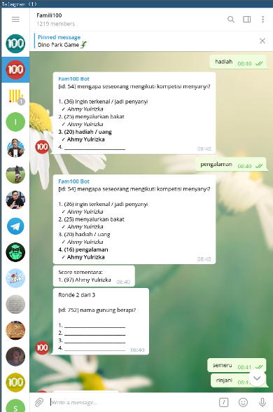

# Fam100

Famm100 is a text game library to play "Family Fued". Currently playable in telegram



Start the game with `/join` command. After enough people join and reach the quorum
the bot will start the game by delivering questions. People can immediately join the game 
and answer the questions. 

## Requirement
* Redis

## Setup 

First you need to acquire TELEGRAM_KEY from [telegram](https://core.telegram.org/bots#6-botfather)
 
### Docker

To run the bot with docker, update docker-compose.yml with your TELEGRAM_KEY 

```bash
$ docker-compose up
```

### Normal go build

```bash
$ go build ./cmd/telegram
$ TELEGRAM_KEY="YOUR_TELEGRAM_KEY" ./telegram
```

## Bot development

If you are interested in developing bot your self with GO, 
This bot is using lib [https://github.com/yulrizka/bot](https://github.com/yulrizka/bot).
The library enables bot development as plugin and currently support multiple chat platform such as
Telegram and Slack.

# Contributors

* Ahmy Yulrizka (yulrizka@gmail.com)
